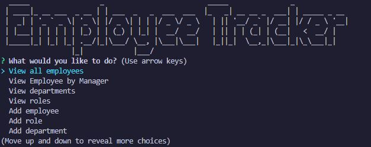
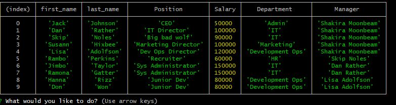

# Employee Tracker
  
  
  ## Description 
  A CLI to connect a MySQL instance to node in order to track a mock employee database. 2 tables with cascading relations lets us assign roles, have roles nested in departments, and allows for employees to have other employee managers
  
  ## Table of Contents
  * [Installation](#installation)
  * [Usage](#usage)
  * [Credits](#credits)
  * [License](#license)
  * [Contributions](#contributing)
  * [Tests](#tests)
  
  ## Installation 
  Dependencies include inquirer, mysql and figlet for cheecky title display. Upon cloning the repo you will need to `npm install` to setup the database you will first need to install [MySQL](https://www.mysql.com/downloads/). You can then setup the database by copying the contents of employeeTracker.sql or by running `mysql -u root -p` and then `source employeeTracker.sql`
  
  ## Usage
  To begin the cli type node app.js. Follow the prompts to view, update, or delete various aspets of the database. Below is an exmpale result of the view employees prompt.
  
   
  
  ## Credits
  All those folks keeping up with mysql and inquirer. Thanks!
  
  ## License
  MIT
  
  ## Contributing
  Not taking contributions at this time
  
  ## Tests
  none
  
  ## Questions
  Have quesitons about this repo? Please reach out on github or via email
  * [clubkemp](https://github.com/clubkemp)
  * kempj2.jk@gmail.com